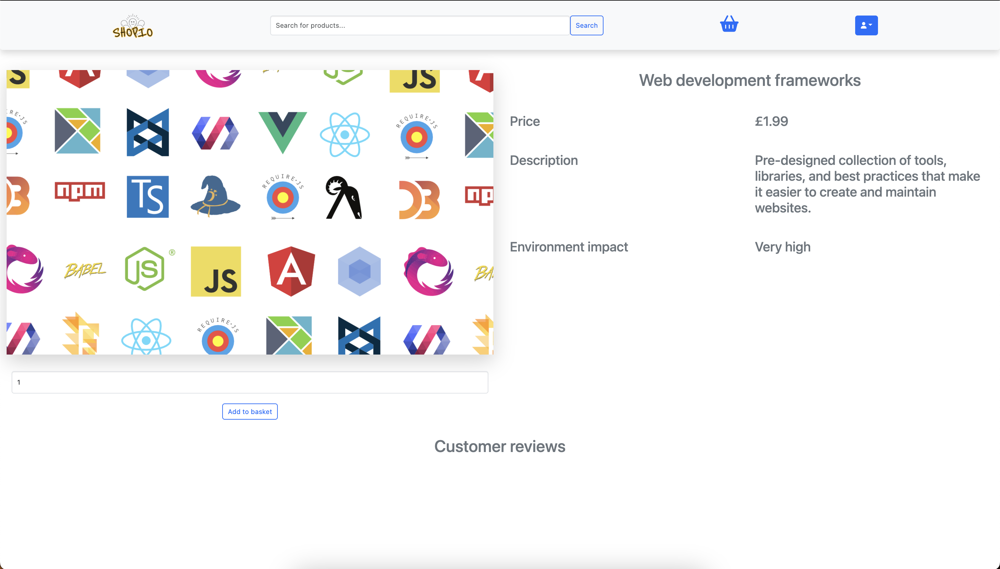
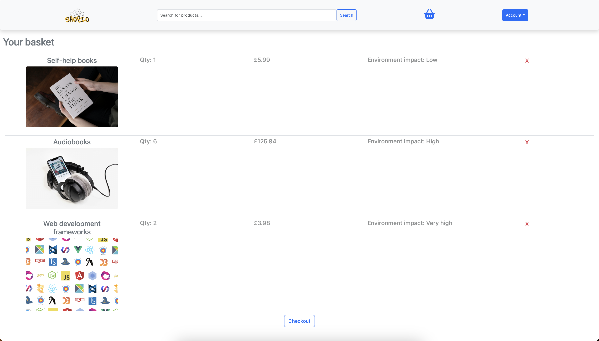
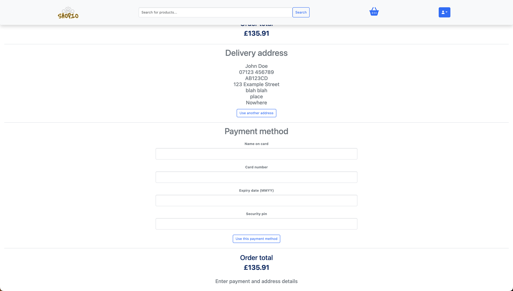

# Shopio - Simple E-commerce Website

Shopio is a simple, fully functional e-commerce website built with Flask, HTML, CSS, and JavaScript. It allows users to browse products, add items to a shopping cart, and check out easily.

## Features

- Browse products
- Add products to shopping cart
- View and modify cart items
- Simple checkout process
- Responsive design for mobile and desktop views

## Screenshots


_The homepage showcasing products._


_A product detail page displaying more information and an option to add to cart._


_The shopping cart page where users can view their selected items._


_The checkout page where users can complete their order._

## Tech Stack

- **Backend**: Flask
- **Frontend**: Standard JavaScript, HTML5, CSS3
- **Database**: SQLite (for local development)
- **Others**: Jinja templating engine (Flask), Bootstrap (for responsive UI)

## Installation

### Prerequisites

- Python 3.8+

### Setup

1. Clone this repository to your local machine:

   ```bash
   git clone https://github.com/yourusername/shopio.git
   ```

2. Setup a virtual environment and install dependencies

   ```bash
   python -m venv venv
   source venv/bin/activate
   pip install -r requirements.txt
   ```

3. Setup database and run application

   ```bash
   cd shopio
   python StoreItems.py
   python main.py
   ```
